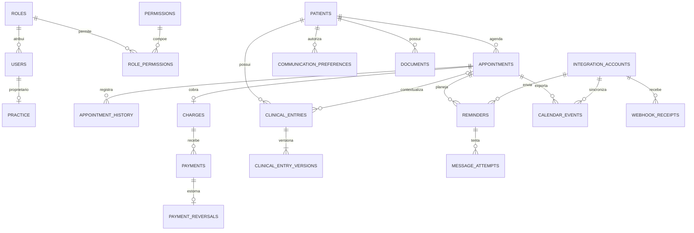

# Modelo de dados MySQL

DDL: [schema.sql](../database/schema.sql). Modelo inicial para banco vazio MySQL 8.4, não executado em servidor nesta entrega. As tabelas operacionais do framework (sessões, recuperação de senha, cache e fila Laravel, se utilizada) serão geradas por migrations próprias; não estão neste DDL de domínio.

## Convenções

PKs `BIGINT UNSIGNED`, tabelas InnoDB, texto utf8mb4, valores `DECIMAL(12,2)` e moeda BRL. Não usar float para dinheiro. DATETIME(6) representa UTC, convertido na aplicação para o fuso IANA configurado. `due_on` é data civil no consultório; `birth_date` é data de nascimento, sem conversão de fuso. Não usar offset fixo como substituto de fuso.

IDs/tokens externos usam comparação binária para preservar maiúsculas/minúsculas. Campos cifrados armazenam envelope autenticado contendo nonce/tag/ciphertext; `encryption_key_id` identifica a chave externa ao banco. `updated_at` será mantido pela aplicação. FKs usam RESTRICT por padrão, sem exclusão em cascata de histórico.

## Entidades e propósito

| Tabela | Propósito e cardinalidade |
|---|---|
| roles | Perfis configuráveis; 1:N usuários |
| permissions | Catálogo de ações, incluindo indicação de exclusividade do proprietário |
| role_permissions | N:N entre perfis e permissões |
| users | Credenciais, perfil, estado ativo e versão de sessão |
| practice | Uma linha, ID 1: proprietário, contato, moeda e fuso; ponto de trava da agenda |
| patients | Cadastro administrativo, sem conteúdo clínico |
| communication_preferences | Uma preferência por paciente/canal, origem e responsável |
| appointments | N consultas por paciente, estado, versão e marcos do atendimento |
| agenda_blocks | Intervalos indisponíveis do profissional |
| appointment_history | Histórico de transições e horários da consulta |
| charges | No máximo uma cobrança por consulta, com valor acordado |
| payments | N recebimentos por cobrança, idempotência e autor |
| payment_reversals | No máximo um estorno integral por pagamento, sem apagar o original |
| clinical_entries | Entradas clínicas do paciente, consulta opcional |
| clinical_entry_versions | Revisões cifradas e numeradas de cada entrada |
| documents | Metadados de arquivos privados do paciente, consulta opcional |
| integration_accounts | Provedor, credenciais cifradas e configuração sem segredos em JSON |
| calendar_events | Vínculo da consulta ao evento externo e versão sincronizada |
| reminders | Planejamento por consulta, versão e canal, com estado e lease |
| message_attempts | Tentativas de envio e identificador externo |
| webhook_receipts | Deduplicação e rastreamento de callbacks autenticados |
| outbox_jobs | Trabalho assíncrono registrado junto à transação de domínio |
| audit_events | Ações administrativas, operacionais e acessos sensíveis, sem conteúdo clínico |

## Relações principais

## Regras além das FKs

O DDL protege referências, valores positivos, intervalos válidos e unicidade. Não substitui autorização ou regras entre múltiplas linhas. Implementar e testar:

1. **Proprietário:** conferir `practice.owner_user_id`, não apenas nome do perfil. `owner_only` é aplicado nas policies mesmo que um perfil auxiliar receba a permissão por erro. Somente o proprietário acessa prontuário, documentos e gestão financeira. Bootstrap cria perfil, usuário e consultório em transação, sem senha padrão.
2. **Agenda:** travar `practice` antes de qualquer mudança de intervalo/estado relevante, bloqueio ou chamada. Conferir sobreposições e apenas um atendimento ativo. `lock_version` protege telas desatualizadas; `schedule_version` só incrementa quando o planejamento externo muda. Definir cancelamento como invalidante da versão e dos jobs pendentes.
3. **Valor acordado:** armazenado em `charges.amount`, fora da entidade enviada ao painel geral. Criar cobrança junto da consulta. A secretária não informa preço arbitrário: o formulário usa valor padrão do profissional ou valor já acordado, sujeito a configuração a implementar. A escolha da política de preço permanece pendente. Restringir JOINs e serialização de valores ao dia local no painel da secretária.
4. **Saldo:** para cobrança aberta, `saldo = amount - soma(payments.amount) + soma(payment_reversals.amount)`. Derivar estados não pago/parcial/pago; não persistir esses estados redundantes. Agregar pagamentos e estornos separadamente por cobrança para evitar duplicação em JOINs. Travar cobrança antes de pagar/estornar; não aceitar pagamento acima do saldo nem reduzir valor abaixo do líquido recebido. Chave idempotente repetida com payload diferente gera conflito.
5. **Estorno:** integral no MVP, exclusivo do psicólogo; correção de recebimento usa estorno e novo lançamento. FK composta garante que o valor estornado corresponde ao original. Ajustes/dispensas exigem motivo auditado. Cobrança com recebimento líquido não pode ser anulada sem tratar os pagamentos. Falta/cancelamento não altera recebimentos.
6. **Integridade clínica:** FKs compostas garantem que uma consulta vinculada ao prontuário/documento pertence ao mesmo paciente. Revisões finalizadas são imutáveis na aplicação; novas correções criam versão com motivo, sob trava da entrada. Não permitir troca de paciente de consulta que já tenha registros financeiros/clínicos; cancelar e criar outra conforme o caso.
7. **Lembretes:** a chave `(appointment_id, schedule_version, channel)` impede dois planos para a mesma versão/canal. Revalidar destinatário atual e permissão antes do envio. Alteração de telefone/preferência é auditada. Serializar a reserva de envio com reagendamento/cancelamento na mesma trava de consulta; reserva não equivale a entrega, e cancelamento em voo não pode prometer impedir aceitação externa.
8. **Integrações:** somente uma conta de envio ativa por canal no MVP, verificada sob trava de `practice`. JSON de settings contém apenas configurações não secretas. Associar eventos externos à versão enviada e ignorar conclusão de job antigo que tentaria sobrescrever estado novo. A chave externa do evento deve ser determinística ou reconciliável para evitar eventos duplicados após timeout.
9. **Callbacks:** persistir evento autenticado e alteração resultante na mesma transação; se usar processamento assíncrono, persistir metadados mínimos necessários em outbox na mesma transação. O digest sozinho não permite reprocessar callback. IDs de mensagem devem ser resolvidos no escopo da conta, usando a relação com reminder. Não regredir entregue para aceito quando callbacks chegam fora de ordem.
10. **Outbox:** payload contém IDs, versões e metadados mínimos, sem prontuário ou tokens. Ligações polimórficas de outbox/auditoria não são FKs: a aplicação valida tipo/ID. Retenção/purga não elimina pendências nem rastreabilidade financeira/clínica.

## Índices e consultas

Agenda: intervalo UTC que corresponde ao dia local, consultando `starts_at >= início AND starts_at < fim`, sem `DATE(starts_at)` no filtro. Fila: status e chegada. Histórico do paciente: paciente e início. Recebimentos: data do pagamento; competência: data da consulta. Pendências: cobrança, vencimento e agregados financeiros. Workers: status e próximo horário. Avaliar EXPLAIN com massa representativa antes de adicionar índices.

Telas operacionais devem selecionar campos explicitamente, nunca expor relações financeiras/clínicas automaticamente. Não calcular totais financeiros no endpoint da secretária, ainda que o frontend os esconda.

## Limitações desta versão

Sem seeds, migrations do framework, aplicação ou integração real. Recorrências, sync tokens de entrada Google, regras configuráveis de lembretes por e-mail e configuração detalhada de preço serão adicionados após as decisões correspondentes. A preferência de comunicação guarda estado corrente; mudanças precisam também de evento de auditoria. SQL foi revisado estruturalmente, mas exige importação e testes de constraints em MySQL 8.4 antes do uso.

Referência técnica: [MySQL — chaves estrangeiras/InnoDB](https://dev.mysql.com/doc/refman/8.4/en/create-table-foreign-keys.html).
